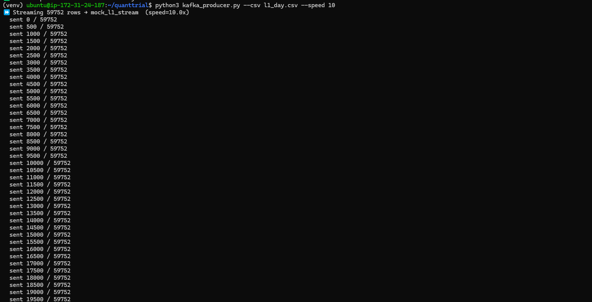
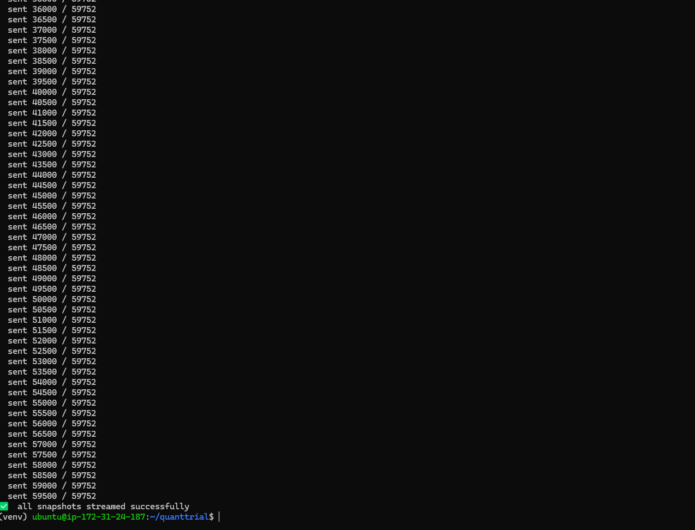
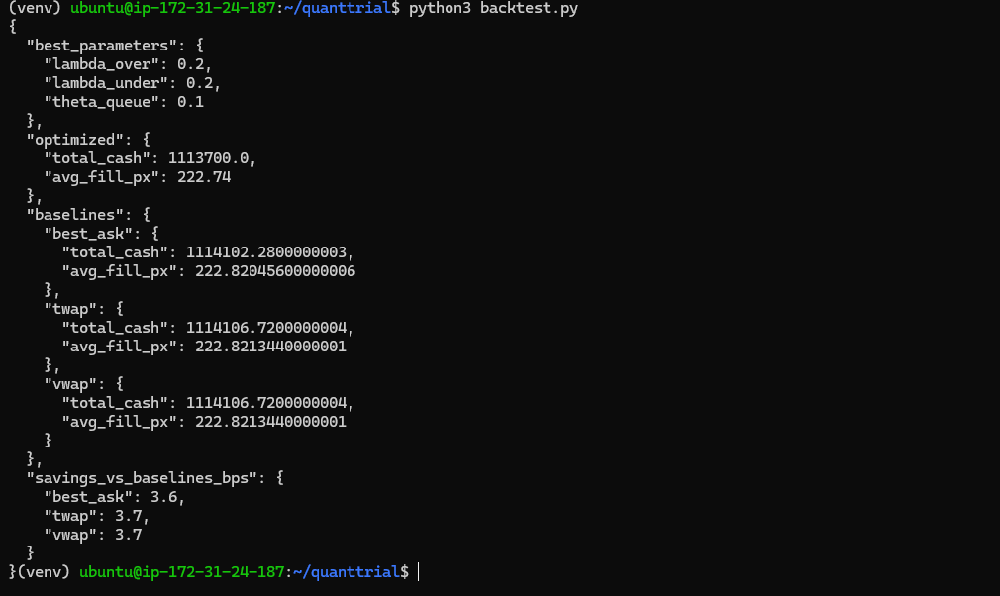
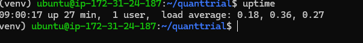
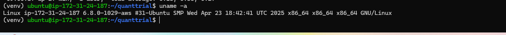
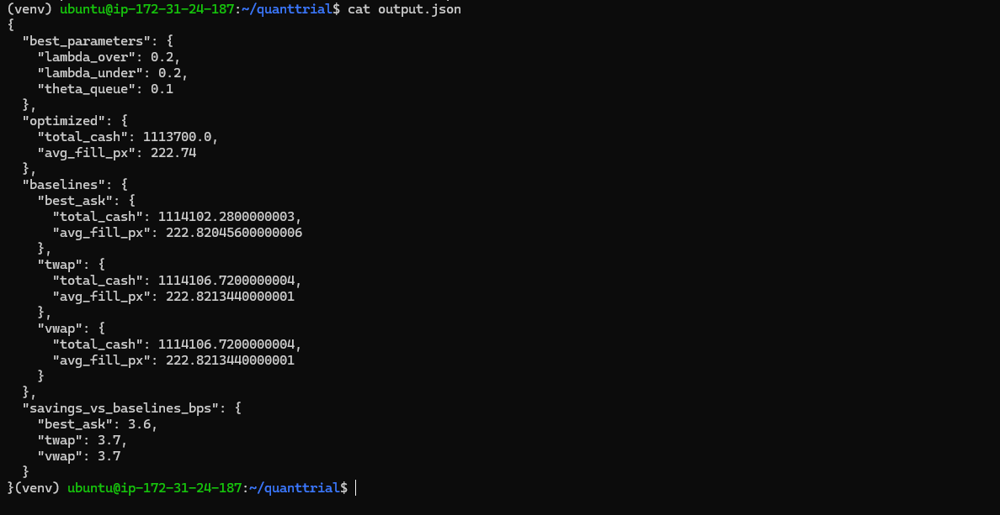

# Blockhouse Quant Developer Trial

## Day 1 – Kafka Producer
* `kafka_producer.py` streams **l1_day.csv** (59 752 rows) ⇒ topic `mock_l1_stream`.
* Speed factor adjustable via `--speed`.

## Day 2 – Backtest & Allocator
* `allocator.py` implements static Cont–Kukanov split.
* `backtest.py`:
  * Consumes Kafka stream.
  * Grid-searches λ_over / λ_under / θ_queue.
  * Benchmarks vs BestAsk, TWAP, VWAP.
  * Outputs required JSON (see `output.json`).

## Day 3 – Reproducible Environment

cd kafka-docker
docker compose up -d

python kafka_producer.py --csv l1_day.csv --speed 10

python backtest.py > output.json

EC2 Instance Type Used

- EC2 instance type used: `t3a.xlarge`

Kafka/Zookeeper Install Steps or Setup Commands
- Kafka/Zookeeper setup steps:
  1. Clone project:
      git clone https://github.com/127suisui/quanttrial.git
     cd quanttrial
  

  2. Install Docker:
     sudo apt update -y
     sudo apt install -y docker.io docker-compose-plugin
        

  3. Start Kafka & Zookeeper using Docker Compose:
     cd kafka-docker
     docker compose up -d
   

  4. Confirm containers are running:
    docker ps

  5. Check if port 9092 is open (Kafka broker):
    sudo lsof -i -P -n | grep 9092
  
Commands Used to Run the Producer & Backtest
- Run producer to stream quotes into Kafka:

  cd ~/quanttrial
  python3 kafka_producer.py --csv l1_day.csv --speed 10
Run backtest consumer:

python3 backtest.py

